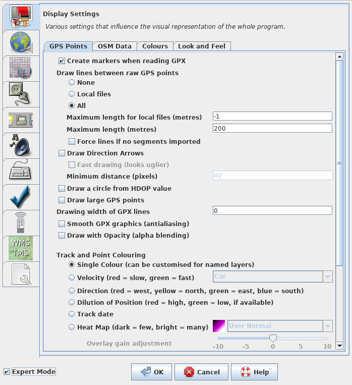
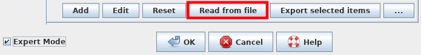
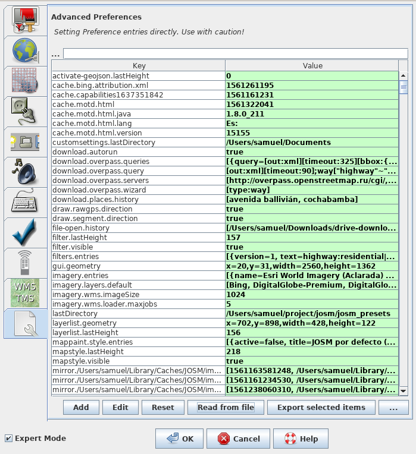

# Install tool for mapping bus routes

The tool we're going to install enables easy mapping of bus routes in developing countries. Of course the tool can be used in developed countries too. The tool we're going to install plays an important part in our mission to map public transportations and in raising communities to take care of it. This tutorial assumes that you have JOSM set up and working and that you have got the configuration file (`.xml`) from your community.

1. Be sure that you have the tool (the configuration file with extension `.xml`) your community uses. Ask them, if you do not have it. Normally they point you to this tutorial the file is for.

2. Open JOSM (this tutorial assumes that you have it already). 

3. Click Edit --> Preferences or click on the icon: 

4. A window opens up and looks like this: 

5. Now we are going to activate the _Expert Mode_ by ticking the checkbox on bottom left: 

6. The window changes like this: 

7. We click on the last icon in the bar to our left: 

8. The window changes to something like: 

9. Now we click on _Read from file_: 

10. Now you can select the file we've downloaded in **step 1** by navigating to its location and selecting it.

11. At the end of the import process just press _OK_: 

12. Now the window looks like this: 

13. We close this window by clicking _OK_: 

14. Now we have to restart JOSM by clicking on _Edit_ --> _Restart_ or by pressing _Ctrl+Alt+Shif+J_: 

15. It takes time to restart but we did it. We now have the tools we need. You might took notice of the changes in the GUI.
