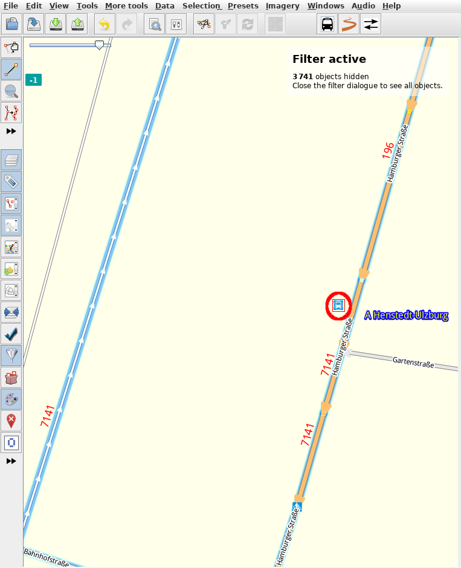

# Adding bus stops

## Adding bus stops and adding platform for waiting passengers

It's a great day to map bus stops and waiting passengers position. But first let me explain you the difference between both. Your community might agreed on to map just one of them or even not to map both. Please ask your community what to follow here so you really map what is wanted.

### Differences between bus stops and waiting platforms

Bus stops and waiting platforms are different things. They look the same but let us take a closer look to see that they aren't the same.

A bus stop is the position where a bus **stops** and **not** where passengers are waiting:

You see the bus is **stopping on the road and not on the sidewalk.** Bus stops are usually mapped as a node on the road itself.

On the other site we have the position where passengers are waiting. Of course **passengers are not waiting on the road, they are waiting on the sidewalk or a dedicated waiting platform**:

The bus here is stopping on the bus stop position on the road like in the picture from above. Next to the bus stop position (or the bus itself) you see the sidewalk/waiting platform where passengers are actually waiting. A waiting platform can have also one or more shelters as you can see on the picture on the right middle site.

**Summary:** A bus stop marks the bus position on the road itself where the bus stops. And passengers are usually waiting on the sidewalk/waiting platform next to the stop position of the bus (the bus stop) and **not** on the road itself.

### Mapping bus stop

Skip this step when your community decided not to map the position on the road where a bus stops. We assume that you already opened JOSM and went to the position on the map where you want to map a bus stop.

**ToDo:** Document the steps that need to be performed.

### Mapping waiting position for passengers

Skip this step when your community decided to just map the bus stop position on the road. We assume that you already opened JOSM and went to the position on the map where you want to map a waiting area for passengers.

1. In the map edit view click the _drawing node/way_ symbol (highlighted red in the picture): 

2. Click on a position on the map where you want to create the node. Double click on the position on the map to add the note and to leave drawing mode so it looks like this (without the red circle around it): 

3. Click on the _bus_ icon or go to _Presets_ --> _Public Transportation_ --> _Waiting plattform_ and a window opens that prompts you for the name of the bus stop (among other details depending on the configuration):

4. Fill in the fields you can fill and then click _Apply Preset_ (highlighted yellow) to apply the preset and to make the editor screen draw you a bus symbol onto the map (without the red circle): 

5. Finish. Start mapping other waiting positions like this.
