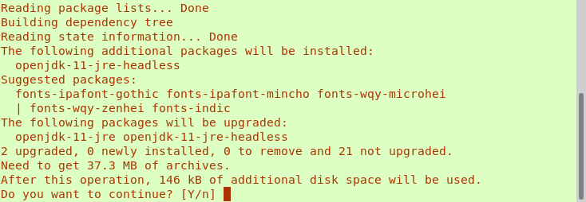

# Install JOSM on linux

## Installing Java

1. Open a terminal by pressing the _WINDOWS_ key on your keyboard and typing `terminal` in the searchbar. It depends on the desktop system and startmenu you use how the searchbar works in detail. You might have to activate it first to start typing.

2. Open the terminal by pressing on the entry that appears. The entry should be labeled like `Terminal`, `Gnome Terminal` or`Xfce Terminal` etc.

3. The window that pop ups should look similiar to mine: 

4. In this window we type `java -version`and press ENTER to check, if it's already installed. Most Linux derivatives have java installed by default.

5. If your window looks like this you have Java already installed and you can skip _Installing Java_: 

6. If your window does not appear to be like in the picture from above then you do not have Java installed. Is this the case we need to install it first:
   
   - Installation on **Debian**, **Ubuntu** and similiar like **Kubuntu**, **Xubuntu**:
     
     - Type `sudo apt install openjdk-11-jre`. If this throws you an error try `su -c "apt install openjdk-11-jre"`. Like every command we type it also requires that you press ENTER to send it to your processor. Additionally both commands prompt you for your password like:
     
     - Type in your password. It's the password for the root account you set during installation or it's the password for your user you use to log in into your computer (if not deactivated). **For security reason you do not see what you type. You do not even see a `*` char for every character you type.**
     
     - You will be given a summary of what will be done with your system and at the end you will be asked, if you are willing to apply these changes. 
     
     - Type in `Y` and press ENTER. Now he's going to download and install Java for us. If you get to know `apt` then it will save you a lot of time. Normally as Windows user you would have to go to download site, download the installer and run it and follow the installation intructions. On Linux this is not necessary.
   
   - Installation on Red-Hat like systems e.g. **Fedora**, **Oracle Linux**:
     
     - Type `sudo yum install openjdk-1.8.0-jre`. Like every command we type it also requires that you press ENTER to send it to your processor. Additionally it prompts you for your password.
     
     - Type in your password. It's the password for the root account you set during installation or it's the password for your user you use to log in into your computer (if not deactivated). **For security reason you do not see what you type. You do not even see a `*` char for every character you type.**
     
     - You will be given a summary of what will be done with your system and at the end you will be asked, if you are willing to apply these changes. 
     
     - Type in `Y` and press ENTER. Now he's going to download and install Java for us. If you get to know `apt` then it will save you a lot of time. Normally as Windows user you would have to go to download site, download the installer and run it and follow the installation intructions. On Linux this is not necessary.
   
   - **ToDo:** _Add more Linux derivatives_

## Installing JOSM

At this point we do not need the Terminal anymore.

1. Download JOSM from [here](https://josm.openstreetmap.de/). 

2. Save it onto your computer or a portable storage device. Save it anywhere you want.

3. With your file browser go to the location where you downloaded the file. Do a right click on the previously downloaded file and click on _Properties_:

4. Head over to the _Permissions_ section and tick there the box _Allow executing file as program_: 

5. We can close the window and double clicking on the program icon should open  JOSM. If JOSM does not open but a pop up appears and you see some buttons and one is labeled _Run_ then click that button and JOSM should open.
