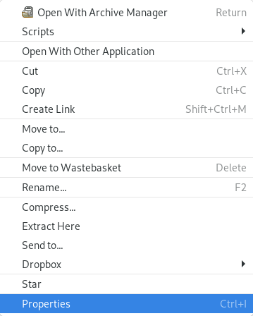
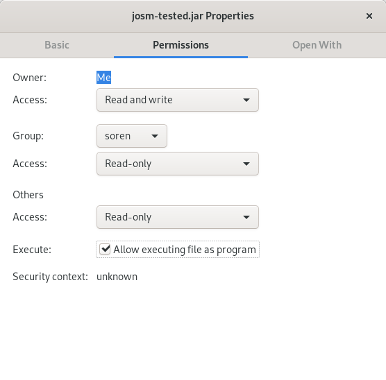

# Installing JOSM on linux

Overview of the various method of installing JOSM on graphical linux operating systems e.g. debian based linux distributions like Ubuntu, Kubuntu and Debian itself or on any non-debian OS having Flatpak.

## 1. Method: Install using Flatpak (recommended)

[Installing using Flatpak](https://flathub.org/apps/details/org.openstreetmap.josm) (external link) is our recommended installation method which is equal across most linux variants. But you can also use the graphical software center installed or via the command

```bash
flatpak install app/org.openstreetmap.josm/x86_64/stable -y
```

or use flatpaks' auto resolving functionality:

```bash
flatpak install josm
```

**Flatpak needs to be installed on your system for this to work. We recommend all JOSM users to install using this method because this is the smartest, safiest and easiest way of installing applications on Linux. So consider installing and setting up Flatpak if you don't already have.**

## 2. Method: Using our bash script (Debian systems only)

1. Install using our own script we wrote for Debian systems which you can download [here](./installJOSM.sh).
2. Save it somewhere on your disk e.g. *Downloads* folder.
3. Flag is as executable
   1. by a right click on the file and
   2. clicking on "Properties"
        
   3. Go to tab "Permissions", "Security", "Rights" or similiar (please don't womder about the title. This procedure is the same for all files)
        
   4. Tick the box "Allow executing file as program", "is executable", "make it executable" or similiar.
   5. Click "Ok", "Save" or similiar. Maybe it is also just enough to close that dialog.

4. Execute it as the superuser (*root* user).

## 3. Method: Using package management system (not recommended)

The old-fashioned more complicated way of installing JOSM on linux is described [here](./linux-konsole.md). Use software centers and other graphical user interfaces as much as possible to do yourself a favour **and** only use the terminal/konsole if it's easier for faster to work with.
