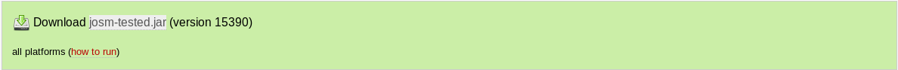

# Installing JOSM on Mac 

We will cover here how to install JOSM on Mac using various methods.

## 1. Method: Install JOSM via Homebrew

1. Open a terminal
2. Execute `brew install --cask josm` to install

## 2 Method: Install JOSM using a package

Use this method if you **don't have** Homebrew installed, installation of Homebrew too complicated or JOSM will be your only application which you will install over Hombrew

1. Go to https://josm.openstreetmap.de
2. Download [MacOS package](https://josm.openstreetmap.de/download/macosx/josm-macosx.zip) (external link).
   
3. Save it somewhere e.g. in your *Downloads* folder and execute it.

## 3. Method: Install JOSM as `.jar`

Use this method if you **have** Java installed, installation of Java JRE on Mac is not a problem for you or JOSM is not your only application which depends on Java.

1. Go to https://josm.openstreetmap.de
2. Download [josm-tested.jar](https://videos.openstreetmap.de/kategorien/Basics/Changesets.mkv) (external link).
   
3. Save it somewhere on your disk e.g. create a *Portable Apps* folder on your desktop and put that file in there. This way you also maintain a good structure in using portable apps.
4. Execute JOSM by double clicking on its file.
   **If nothing happens over 10 seconds (depending on your hardware) that means probably you haven’t Java installed or the file association *.jar* not properly associated with Java.**
