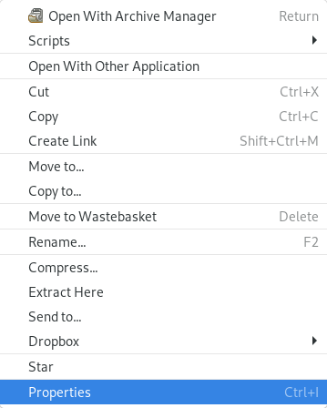
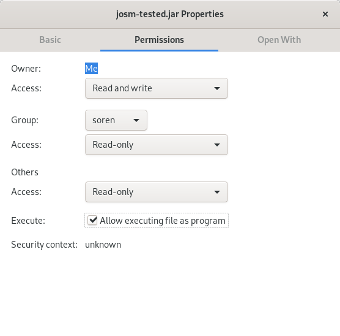

# Installing JOSM on linux

Overview of the various method of installing JOSM on linux operating systems with a desktop environment like debian based linux distributions like Ubuntu, Kubuntu and Debian itself with a graphical interface (desktop environment) installed.

**Use one of the following methods to install JOSM on linux:**

- [Install using Flatpak](https://flathub.org/apps/details/org.openstreetmap.josm) (external link, recommended installation method), your graphical software center or via the command

  ```bash
  flatpak install app/org.openstreetmap.josm/x86_64/stable -y
  ```

  or use flatpaks' auto resolving functionality:

  ```bash
  flatpak install josm
  ```

  **Flatpak needs to be installed on your system for this to work. We recommend all JOSM users to install JOSM using this method because this is the smartest, safiest and easiest way of installing applications on Linux. So consider installing and setting up Flatpak if you don't already have.**

- Install using our own script we wrote for Debian systems which you can download [here](./installJOSM.sh). After downloading mark it as executable and execute it as superuser (root).
  Flagging it executable can be done

  1. by a right click on the file and
  2. clicking on "Properties"
     
  3. Go to tab "Permissions", "Security", "Rights" or similiar (please don't womder about the title. This procedure is the same for all files)
     
  4. Tick the box "Allow executing file as program", "is executable", "make it executable" or similiar.
  5. Click "Ok", "Save" or similiar. Maybe it is also just enough to close that dialog.
- [Manually installing using the package management system](./viaconsole.md) (not recommended)

