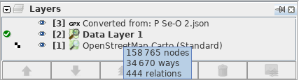

# Explaining _Layers_ in JOSM editor

You might have seen this before and you might wonder what is this for.

The entries there represent the order. The first one at the top ( _Converted from: P Se-O 2.json_ ) is the one that will be shown on top of the other layers _Data Layer 1_ and _OpenStreetMap Carto (Standard)_.

As a rule to decide the sorting: The layer who contains the most data is the one who's at the bottom of the list (here: _OpenStreetMap Carto (Standard)_ ). The layer who contains the fewest data is at the top of the list (here: _Converted from: P Se-O 2.json_).

- Imagery like *OpenStreetMap Carto (Standard)* is usually at the bottom on the list because it is a bunch of images and images contain a lot of data. Imagery is also called the _underline map_.

- OSM data representations which you can modify and upload like _Data Layer 1_ are usually in the middle or at the top of the list. This is the layer which contains the most data after the imagery.

- When adding external data you received from authorities to OSM then you have something like *Converted from: P Se-O 2.json* at the top of the list because usually they contain just specified datasets and not all. This means they usually does not contain much data.

Inside the table you can drag and drop individual rows (entries) to change their position on the list orselect an entry and then click one of the arrow buttons.

- I recommend the following order from top to bottom:
  
  - External datasets received by authorities.
  
  - Data already in OSM
  
  - Imagery

Selecting an entry (layer) and then clicking on the button with the _Rubbish bin_ symbol deletes that selected layer. **Be careful not to loose any changes performed on the data the layer represents.**

Clicking on the button with the _eye_ symbol toggles the layer on/off. Meaning it changes its visibility on the map.

