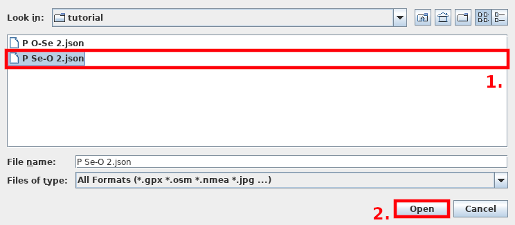
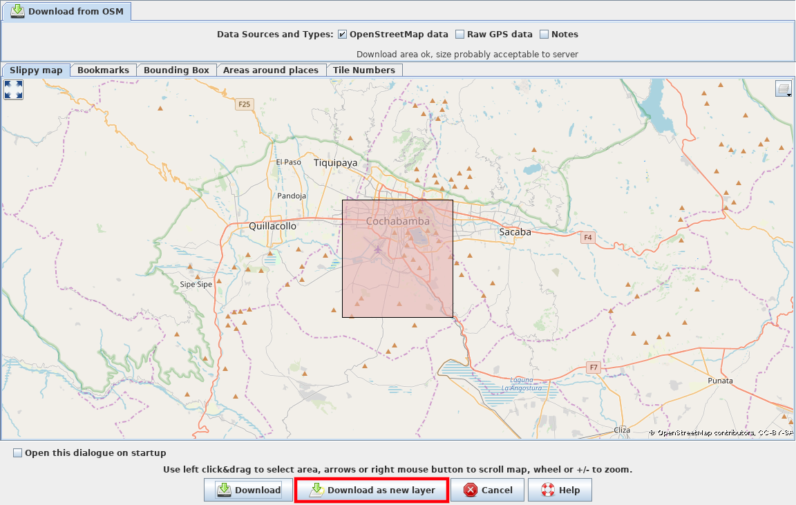
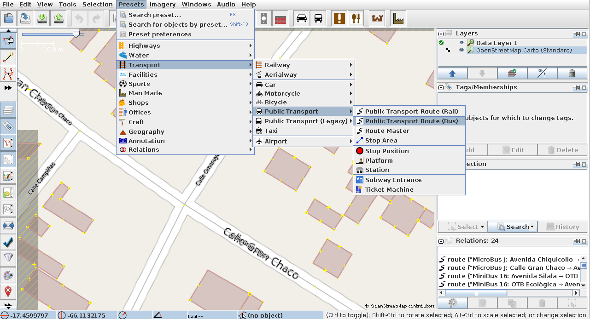
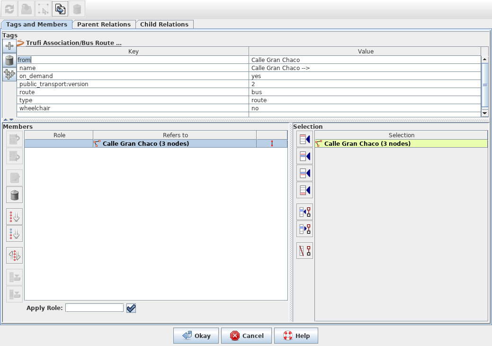
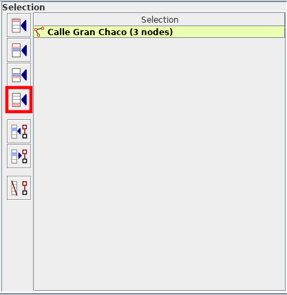
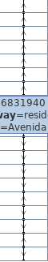
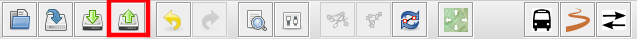

# Mapping informal bus routes

This tutorial shows how to add informal bus routes to OpenStreetMap. For this tutorial to be effective you need [JOSM installed](../installing-josm-on-linux/index.md) and the [custom mapping tool](../installing-mapping-tool/index.md) (when requirred by your community). In order to upload your changes to OSM you need also your JOSM installation [synced](../oauth-josm/index.md) with your OpenStreetMap account.

## Preparing our workplace

1. Open JOSM (this tutorial assumes that you have it already). 

2. A window should pop up like 

3. First we should load the data you received from your community. Click on _File_ in the topbar:

4. Then we click _Open_ in the menu: 

5. A dialog appear and prompts you to select the file you've received from your community. Go to the location where you saved the `*.geojson`, click on that file and then _Open_:

6. Wait for loading process to finish. Once finish the user interface changes significantly. What we see now is our editor: 

7. Before we can start mapping we need to prepare the editor and load OSM data in it. Let us load data from OSM first. Click on _File_ in the topbar again: 

8. And then _Download data..._: 

9. We begin to love popups. In this one we probably do not need to tweak the boundingbox you see in the displayed map because JOSM did this for us because we've loaded the `*.geojson` file: 

10. Click _Download as new layer_. If it says that the selected area is to big then resize it by returning to that dialog, click and drag the mouse over a smaller part of the previously selected area. Release the mouse to create a new bounding box. Repeat this step until the system is happy :)

11. This looks more promising: 

12. But we're not happy yet, aren't we? To make it even more beautiful we need to add the OSM tiles. We go to _Imagery_ in the topbar and then select _OpenStreetMap Carto (Standard)_. Beautiful, isn't it.

13. Let us take a quick look on the _Layers_ section on the top right site of the editor.
    
    
    
    By the way: You can resize the sections by clicking on the respective boundaries and dragging them to the position of your desire.

14. Right click on the entry with the file extension `.geojson` or `.json`. Then click _Convert to GPX layer_: 

15. The name of the entry changed and looks like this: 

16. We right click on the entry again and select
    
    - _Customize Colour_ at first,
    
    - _Download from OSM along this track_ at second
    
    - and _Precache imagery tiles along this track_ at last.

17. Additionally we click on the entry again and select _Customize track drawing_ and a new popup shows up: 

18. In the textfield next to _Drawing width of GPX lines_ type in the width in px. I recommend typing in `5`. Then click _Okay_.

19. Press ALT+SHIFT+F1 to stop automatically downloading of data while moving the map. Alternatively click on _File_ in the topbar and then _Download OSM data continuously_. It's a toogle. Then navigate inside the map to the end of the line. To navigate in the map you need to hold the right mouse key while moving the mouse. Use your mouse wheel to zoom in or out. **The line has two ends: _end_ and _start_. Select the one where the arrows come from and not the end where they point to.**
    
    - End <-- Start
    
    - 

## Preparing OSM data along the route we want to add

Before we start we need to do some work on the OSM data itself. In the last image you see the darkred coloured line and the blue one. The first line is the bus route and the latter the street in OSM the bus drives. This part of the tutorial covers how to turn the first line into useful data.

Press ALT+SHIFT+F1 to stop/start automatically downloading of data while moving the map. Alternatively click on *File* in the topbar and then *Download OSM data continuously*. It's a toogle. When you move the map to a section where no data is available then toggle _Download OSM data continuously_ on. If you use the zoom function extensively then turn _Download OSM data continuously_ off.

1. Select the line which is not the darkred one but which is aligned to it: 

2. We see not the whole line turns red. What is for us one line (the blue one) is in the eyes of the computer not one. The line has been split on the position where _Calle Campinas_ crosses our selected line.

3. We want to create a route so we click on the line icon in the symbol bar right under the tobar: 

4. A popup shows up prompting you for data you've received from your community. Type in the data in the corresponding fields and click _Okay_. A new window opens up and gives an overview: 

5. On the right site you see a list of all objects (streets) you've selected in the JOSM editor. On the left site you see a list of all objects (streets) already added to the relation. **Don't close that dialog, we need it!**

6. Select other streets along the darkred line, go to the dialog again and click on the red highlighted entry where the last row of four rows in total is selected to add the selection to the route list on the right site.You can select more than one street by pressing and holding the key you use to start a new sentence with an upper letter. 

7. Repeat step _6_ after you have the following situation: 

8. _Newton, we've got a problem!_ What do we next is spliting the way. So we click on the map to deselect our selection. Be sure to add all streets except the street in question to the route like in step _6_.

9. Select the street (way) in question. Zoom to the point where you need the split: Zoomed in (cuted view):

10. Select the street (here in blue).

11. Hold down the key you use to write an upper letter at the beginning of a new sentence. Select the square (JOSM highlights it yellow) while holding down the key.

12. In the topbar click on _Tools_ and then on _Split way_. Alternatively press key _P_. A dialog prompts you to decide which way segment should preserve history. Just ignore it and click _Okay_. Deselect everything by clicking on a free space on the map.

13. Continue with step _6_ until the end of the darkred line.

14. When you reached the end of the darkred line, it means you are almost done. Now we need to validate your work. For that we go to the dialog you should leave open the whole time while mapping.

15. You should consult someone with validation if you're unfamilar with it. It's a critical part. Take a look on the different options the dialog offers you.
    
    - Select an entry from the list on the left site. Right click on it and click _Zoom to_ to zoom to that object on the map. Use this method to repair objects having the following symbol or similiar:
    
    - Use the feature _Zoom to_ and the map to find missing ways (streets). and hover on the buttons of the highlighted red area next to the _selection_ table to get what they do with the selection.
    
    - Black is your friend :) Everything black in the validation line means that the data is okay.
    
    - The first and last entry show always a red symbol in the validation line because one end is not connected to another way (street). This is logical. A bus route usually ends somewhere.

16. In the route list dialog click _Okay_ to create that route. Do it when you think you're finish.

17. Click on the _Upload icon_ in the symbolbar right under the topbar: 

18. Ignore the dialogue _Suspicious data found_ when it popups or fix the issues. Inform your community about that and tell them what you've edited.

19. A new popup appears: 

20. Fil in the information requested and then click _Upload Changes_ to finish upload process.
