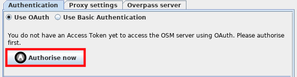
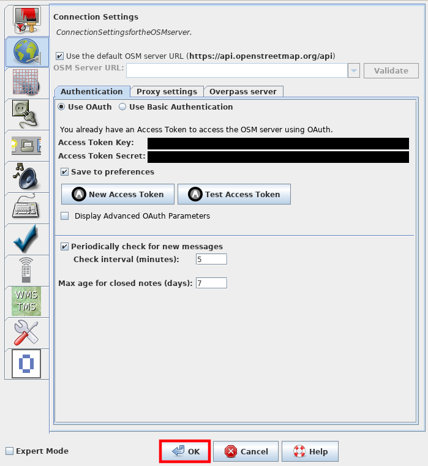

# Documentation

## How to link your OpenStreetMap account to JOSM

Today we're going to link JOSM with your OSM account so you can upload changes from inside JOSM which we all extremely want. Perhaps the configuration for this has been done by your community by letting you set up the [JOSM configuration file](../installing-mapping-tool/index.md) or doing it for you. Just follow the instructions here when said so otherwise you might damage something.

1. Open JOSM: 

2. Click on the _settings_ symbol:

3. The window that opens looks like this: 

4. Click on the symbol for _Connection Settings_: 

5. Then click on the button I highlighted red here: 

6. A new window opens up and looks like this: 

7. Enter your OSM Username in the first field that is highlighted red.

8. Then your OSM Password in the second field that is highlighted red.

9. Finish typing your credentials? Then click _Authorize now_ right below the last text field.

10. Wait a moment for the transfer to complete. A summary of the oauthorisation process should popup like this: 

11. Click _Accept Access Token_ to put this to a good end.

12. Now your _Connection settings_ screen looks like this: 

13. Click _ok_ to close this dialog. Now JOSM is linked to your OSM account and you can start mapping and improving the map right now. Yeah :)
