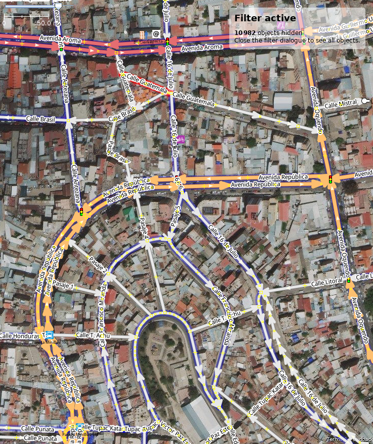
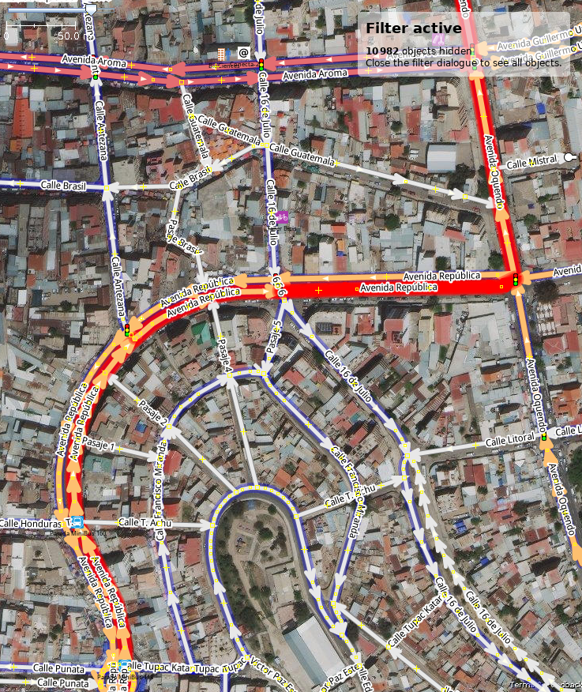

# Understanding OSM relations

Relations use existing objects in the OpenStreetMap database to create new data out of existing data by connecting them. In OSM several types of relations exist e.g. the [Relation 9373675](https://www.openstreetmap.org/relation/9373675) is a bus relation with `type=route`. 

---

We see here a bunch of streets with their names (the street --> la calle). Streets are represented by one or more ways. On its own we cannot get to know which bus line is on which street e.g. we do not know that the route of _Bus 101_ uses the streets  _Avenida Republica_ and _Avenida Oquendo_. This is where relations come in. Relations allow us to connect streets to a route so we know exactly which bus drives in which street.

The orange line shows the route _Bus 101_ is driving. What do we now is adding this information to OSM. 

We see a small part of the bus relation here. And everything that is part of the relation is marked red. That means all streets (ways) that are marked red actually belong to the relation: We connected the street *Avenida Republica* with the street *Avenida Oquenda* in our relation. So a relation is basically a set of nodes and ways in a specified order and describes a high level feature (e.g. bus route) by just combining existing data.

JOSM can show us the members (streets) of the relation not just graphical but also tabular. The table shows an ordered list from top to bottom of the ways that are part of the relation.

**Summary:** Relations in OSM are high level feature that build something new (e.g. a bus route) upon existing OpenStreetMap data (e.g, streets (mapped ways)). So relations can be used to add bus routes and much more complexity and makes use of added infrastructure.
