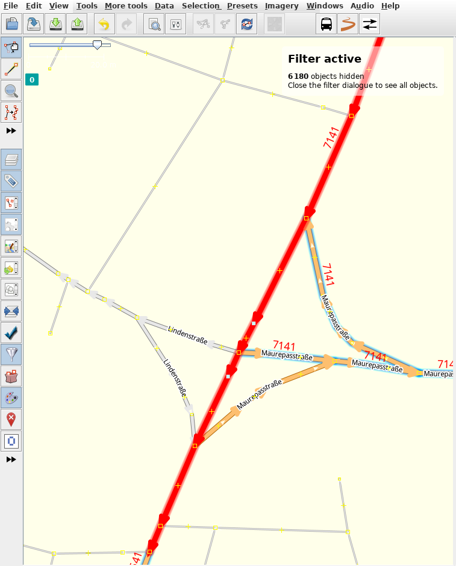

# Documentation

## Split a way into two or more

Spliting ways (cuting one way into two or more) can be necessary when adding a relation that follows the way just for some while and **not** till the end. Adding the way to a relation without spliting it can have unwanted side effects. Spliting a way is also necessary when tags aren't consistent on the way (From position A to position B the tags differ from those from position C to position D).

## Spliting ways

We assume that you have JOSM already opened and went to a way you want to split.

1. Click on the way you want to split. It should turn red: 

2. Now hold the _SHIFT_ key (one above the _Ctrl_ key) and select a node on the marked way where you want to split the way up into two. A node is represented as a square with yellow borders like 

3. After selecting it, it should also turn red like 

4. Now select _Tools_ from the menu bar: 

5. Then click on _Split way_ and you're done! Repeat the steps until you're happy :)
